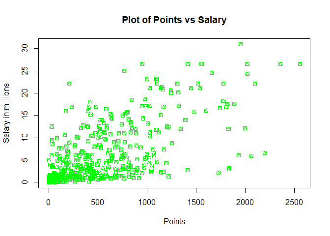
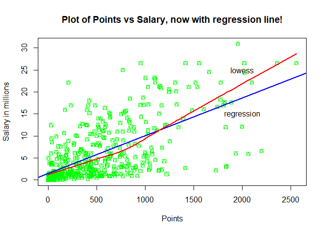
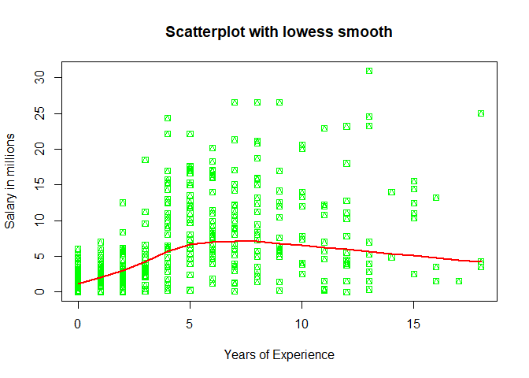
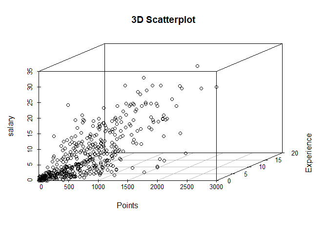
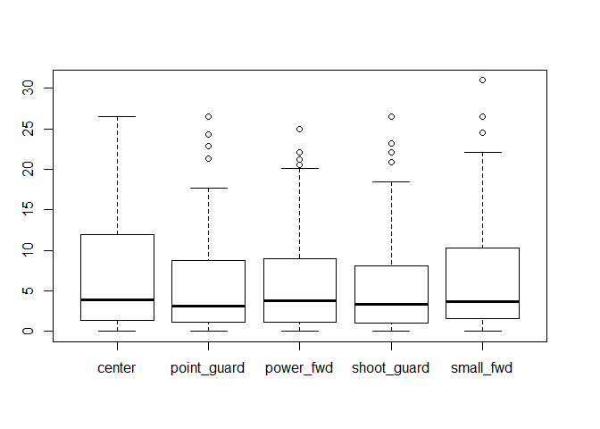

hw01-jesse-gao
================
Jesse Gao
September 23, 2017

``` r
load("data/nba2017-salary-points.RData")
ls()
```

    ## [1] "experience" "player"     "points"     "points1"    "points2"   
    ## [6] "points3"    "position"   "salary"     "team"

Preprocessing
-------------

``` r
#preprocessing
salaryMillions = round(salary/1000000, digits = 2)
#salaryMillions
experienceInt = as.integer(replace(experience, experience == "R", "0"))
#experienceInt
positionFactor = replace(position, position == "C", 'center')
positionFactor = replace(positionFactor, positionFactor == "SF", 'small_fwd')
positionFactor = replace(positionFactor, positionFactor == "PF", 'power_fwd')
positionFactor = replace(positionFactor, positionFactor == "SG", 'shoot_guard')
positionFactor = replace(positionFactor, positionFactor == "PG", 'point_guard')
positionFactor = factor(positionFactor)
#positionFactor
table(positionFactor)
```

    ## positionFactor
    ##      center point_guard   power_fwd shoot_guard   small_fwd 
    ##          89          85          89          95          83

Scatterplot of points and salary
================================

``` r
plot(points, salaryMillions, pch = 14, col = "GREEN", xlab = "Points", ylab = "Salary in millions", main = "Plot of Points vs Salary")
```



It appears that the salary increases with points.

Correlation between Points and Salary
-------------------------------------

``` r
x = points
y = salaryMillions
n = length(salaryMillions)
n
```

    ## [1] 441

``` r
xmean = sum(points)/n
xmean
```

    ## [1] 546.6054

``` r
ymean = sum(salaryMillions)/n
ymean
```

    ## [1] 6.186689

``` r
varX = (1/(n - 1))*sum((x-xmean)^2)
varX
```

    ## [1] 239136.2

``` r
varY = (1/(n - 1))*sum((y-ymean)^2)
varY
```

    ## [1] 43.19524

``` r
sdX = sqrt(varX)
sdX
```

    ## [1] 489.0156

``` r
sdY = sqrt(varY)
sdY
```

    ## [1] 6.572309

``` r
covXY = (1/(n - 1)) * sum((y-ymean)*(x-xmean))
covXY
```

    ## [1] 2046.424

``` r
corXY = (covXY/(sdX*sdY))
corXY
```

    ## [1] 0.6367296

Simple linear regression
========================

``` r
b1 = corXY*sdY/sdX
b0 = ymean - b1*xmean
yhat = b0 + b1*x
summary(yhat)
```

    ##    Min. 1st Qu.  Median    Mean 3rd Qu.    Max. 
    ##   1.509   2.844   5.206   6.187   8.184  23.399

1.  see above
2.  Regression equation is: *y*<sub>*h**a**t*</sub> = *b*<sub>0</sub> + *b*<sub>1</sub> \* *x*
3.  b1 is the predicted salary increase per point scored for a player.
4.  b0 is the predicted salary for a player who scored zero points
5.  see below

``` r
testPoints = c(0, 100, 500, 1000, 2000)
predictedSalaries = b0 + b1*testPoints
predictedSalaries
```

    ## [1]  1.509077  2.364833  5.787860 10.066644 18.624211

Plotting the regression line
----------------------------

``` r
plot(points, salaryMillions, pch = 14, col = "GREEN", xlab = "Points", ylab = "Salary in millions", main = "Plot of Points vs Salary, now with regression line!")
abline(b0, b1, lwd = 2, col = "BLUE")
lines(lowess(points, salaryMillions), lwd = 2, col = "RED")
text(x = c(2000, 2000), y = c(15, 25), labels = c("regression", "lowess"))
```



Regression residuals and Coeeficient of Determination R^2
---------------------------------------------------------

``` r
residuals = y - yhat
summary(residuals)
```

    ##    Min. 1st Qu.  Median    Mean 3rd Qu.    Max. 
    ## -14.187  -2.792  -1.095   0.000   2.556  18.814

``` r
rss = sum(residuals^2)
rss
```

    ## [1] 11300.45

``` r
tss = sum((y-ymean)^2)
tss
```

    ## [1] 19005.91

``` r
R2 = 1- rss/tss
R2
```

    ## [1] 0.4054246

Exploring Position and Experience
---------------------------------

``` r
plot(experienceInt, salaryMillions, pch = 14, col = "GREEN", xlab = "Years of Experience", ylab = "Salary in millions", main = "Scatterplot with lowess smooth")
lines(lowess(experienceInt, salaryMillions), lwd = 2, col = "RED")
```



``` r
library(scatterplot3d)
scatterplot3d(points, experienceInt, salaryMillions, xlab = "Points", ylab = "Experience", zlab = "salary", main = "3D Scatterplot")
```



``` r
boxplot(salaryMillions~positionFactor, positionFactor)
```



1.  It appears that the salary is highly concentrated in the lesser years and scatters more as years increase. That means the starting salary is much more stable than salary later on. The lowess line seems to peak at 5-10 years, which means most of the players in that group are paid more than those in other groups.
2.  It is very apparent that bulk of players don't have a lot of points, experience, or salary. The number of players decrease as all three factors increase.
3.  Most of the players in all five groups are under the 15 million mark for salary. Center seems to have the most percentage of people who go beyond that mark.

Comments and reflections
========================

Nothing was really hard in this hw, the labs and lecture explained everything pretty well. Boxplot took longer than expected to figure out, but Piazza had my back. I've been using git for a while now so it's pretty much second nature Piazza and google helped me out. It took 3 hours to complete this assignment. The most time consuming part was googling everything I am not sure how to describe each graph, which was frustrating because no instructions were given on how to either. I was proud of finishing this in 3 hours.
