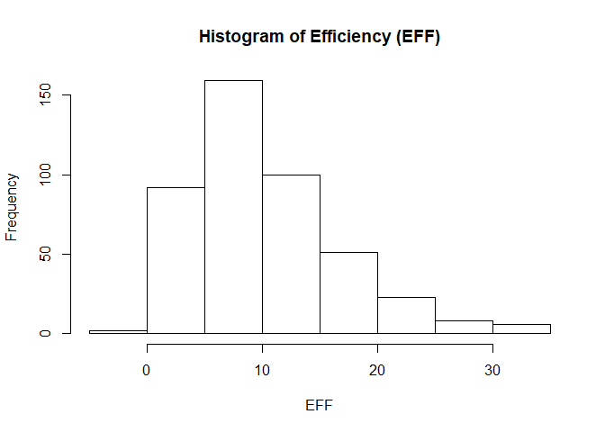
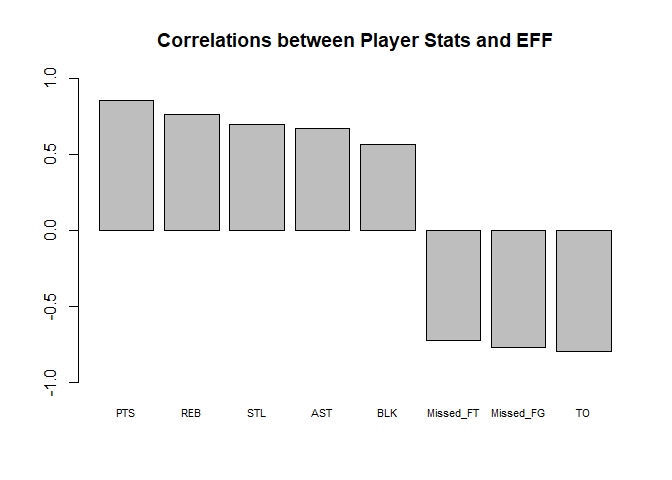
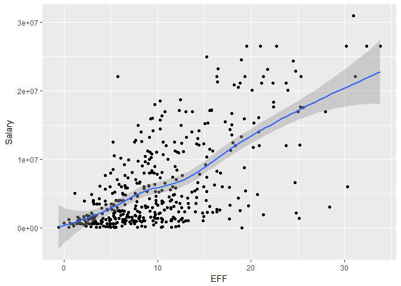
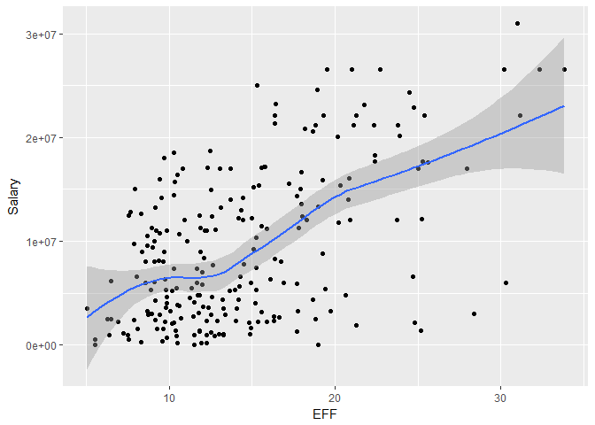

hw02-Jesse-Gao
================
Jesse Gao
September 30, 2017

1) Create a data dictionary
---------------------------

see data dictionary file

2) Import the data in R
-----------------------

``` r
dat = read.csv("./data/nba2017-player-statistics.csv", colClasses = c("character", "character", "factor", "character", "double", rep("integer", 19)))
str(dat)
```

    ## 'data.frame':    441 obs. of  24 variables:
    ##  $ Player      : chr  "Al Horford" "Amir Johnson" "Avery Bradley" "Demetrius Jackson" ...
    ##  $ Team        : chr  "BOS" "BOS" "BOS" "BOS" ...
    ##  $ Position    : Factor w/ 5 levels "C","PF","PG",..: 1 2 5 3 4 3 4 5 4 2 ...
    ##  $ Experience  : chr  "9" "11" "6" "R" ...
    ##  $ Salary      : num  26540100 12000000 8269663 1450000 1410598 ...
    ##  $ Rank        : int  4 6 5 15 11 1 3 13 8 10 ...
    ##  $ Age         : int  30 29 26 22 31 27 26 21 20 29 ...
    ##  $ GP          : int  68 80 55 5 47 76 72 29 78 78 ...
    ##  $ GS          : int  68 77 55 0 0 76 72 0 20 6 ...
    ##  $ MIN         : int  2193 1608 1835 17 538 2569 2335 220 1341 1232 ...
    ##  $ FGM         : int  379 213 359 3 95 682 333 25 192 114 ...
    ##  $ FGA         : int  801 370 775 4 232 1473 720 58 423 262 ...
    ##  $ Points3     : int  86 27 108 1 39 245 157 12 46 45 ...
    ##  $ Points3_atts: int  242 66 277 1 111 646 394 35 135 130 ...
    ##  $ Points2     : int  293 186 251 2 56 437 176 13 146 69 ...
    ##  $ Points2_atts: int  559 304 498 3 121 827 326 23 288 132 ...
    ##  $ FTM         : int  108 67 68 3 33 590 176 6 85 26 ...
    ##  $ FTA         : int  135 100 93 6 41 649 217 9 124 37 ...
    ##  $ OREB        : int  95 117 65 2 17 43 48 6 45 60 ...
    ##  $ DREB        : int  369 248 269 2 68 162 367 20 175 213 ...
    ##  $ AST         : int  337 140 121 3 33 449 155 4 64 71 ...
    ##  $ STL         : int  52 52 68 0 9 70 72 10 35 26 ...
    ##  $ BLK         : int  87 62 11 0 7 13 23 2 18 17 ...
    ##  $ TO          : int  116 77 88 0 25 210 79 4 68 39 ...

``` r
library(readr)
```

    ## Warning: package 'readr' was built under R version 3.4.2

``` r
datr = read_csv("./data/nba2017-player-statistics.csv", col_types = cols(Player = col_character(), Team = col_character(), Position = col_factor(levels = c('C', 'PF', 'PG',
'SF', 'SG')), Experience = col_character(), Salary = col_double()))
str(datr)
```

    ## Classes 'tbl_df', 'tbl' and 'data.frame':    441 obs. of  24 variables:
    ##  $ Player      : chr  "Al Horford" "Amir Johnson" "Avery Bradley" "Demetrius Jackson" ...
    ##  $ Team        : chr  "BOS" "BOS" "BOS" "BOS" ...
    ##  $ Position    : Factor w/ 5 levels "C","PF","PG",..: 1 2 5 3 4 3 4 5 4 2 ...
    ##  $ Experience  : chr  "9" "11" "6" "R" ...
    ##  $ Salary      : num  26540100 12000000 8269663 1450000 1410598 ...
    ##  $ Rank        : int  4 6 5 15 11 1 3 13 8 10 ...
    ##  $ Age         : int  30 29 26 22 31 27 26 21 20 29 ...
    ##  $ GP          : int  68 80 55 5 47 76 72 29 78 78 ...
    ##  $ GS          : int  68 77 55 0 0 76 72 0 20 6 ...
    ##  $ MIN         : int  2193 1608 1835 17 538 2569 2335 220 1341 1232 ...
    ##  $ FGM         : int  379 213 359 3 95 682 333 25 192 114 ...
    ##  $ FGA         : int  801 370 775 4 232 1473 720 58 423 262 ...
    ##  $ Points3     : int  86 27 108 1 39 245 157 12 46 45 ...
    ##  $ Points3_atts: int  242 66 277 1 111 646 394 35 135 130 ...
    ##  $ Points2     : int  293 186 251 2 56 437 176 13 146 69 ...
    ##  $ Points2_atts: int  559 304 498 3 121 827 326 23 288 132 ...
    ##  $ FTM         : int  108 67 68 3 33 590 176 6 85 26 ...
    ##  $ FTA         : int  135 100 93 6 41 649 217 9 124 37 ...
    ##  $ OREB        : int  95 117 65 2 17 43 48 6 45 60 ...
    ##  $ DREB        : int  369 248 269 2 68 162 367 20 175 213 ...
    ##  $ AST         : int  337 140 121 3 33 449 155 4 64 71 ...
    ##  $ STL         : int  52 52 68 0 9 70 72 10 35 26 ...
    ##  $ BLK         : int  87 62 11 0 7 13 23 2 18 17 ...
    ##  $ TO          : int  116 77 88 0 25 210 79 4 68 39 ...
    ##  - attr(*, "spec")=List of 2
    ##   ..$ cols   :List of 24
    ##   .. ..$ Player      : list()
    ##   .. .. ..- attr(*, "class")= chr  "collector_character" "collector"
    ##   .. ..$ Team        : list()
    ##   .. .. ..- attr(*, "class")= chr  "collector_character" "collector"
    ##   .. ..$ Position    :List of 3
    ##   .. .. ..$ levels    : chr  "C" "PF" "PG" "SF" ...
    ##   .. .. ..$ ordered   : logi FALSE
    ##   .. .. ..$ include_na: logi FALSE
    ##   .. .. ..- attr(*, "class")= chr  "collector_factor" "collector"
    ##   .. ..$ Experience  : list()
    ##   .. .. ..- attr(*, "class")= chr  "collector_character" "collector"
    ##   .. ..$ Salary      : list()
    ##   .. .. ..- attr(*, "class")= chr  "collector_double" "collector"
    ##   .. ..$ Rank        : list()
    ##   .. .. ..- attr(*, "class")= chr  "collector_integer" "collector"
    ##   .. ..$ Age         : list()
    ##   .. .. ..- attr(*, "class")= chr  "collector_integer" "collector"
    ##   .. ..$ GP          : list()
    ##   .. .. ..- attr(*, "class")= chr  "collector_integer" "collector"
    ##   .. ..$ GS          : list()
    ##   .. .. ..- attr(*, "class")= chr  "collector_integer" "collector"
    ##   .. ..$ MIN         : list()
    ##   .. .. ..- attr(*, "class")= chr  "collector_integer" "collector"
    ##   .. ..$ FGM         : list()
    ##   .. .. ..- attr(*, "class")= chr  "collector_integer" "collector"
    ##   .. ..$ FGA         : list()
    ##   .. .. ..- attr(*, "class")= chr  "collector_integer" "collector"
    ##   .. ..$ Points3     : list()
    ##   .. .. ..- attr(*, "class")= chr  "collector_integer" "collector"
    ##   .. ..$ Points3_atts: list()
    ##   .. .. ..- attr(*, "class")= chr  "collector_integer" "collector"
    ##   .. ..$ Points2     : list()
    ##   .. .. ..- attr(*, "class")= chr  "collector_integer" "collector"
    ##   .. ..$ Points2_atts: list()
    ##   .. .. ..- attr(*, "class")= chr  "collector_integer" "collector"
    ##   .. ..$ FTM         : list()
    ##   .. .. ..- attr(*, "class")= chr  "collector_integer" "collector"
    ##   .. ..$ FTA         : list()
    ##   .. .. ..- attr(*, "class")= chr  "collector_integer" "collector"
    ##   .. ..$ OREB        : list()
    ##   .. .. ..- attr(*, "class")= chr  "collector_integer" "collector"
    ##   .. ..$ DREB        : list()
    ##   .. .. ..- attr(*, "class")= chr  "collector_integer" "collector"
    ##   .. ..$ AST         : list()
    ##   .. .. ..- attr(*, "class")= chr  "collector_integer" "collector"
    ##   .. ..$ STL         : list()
    ##   .. .. ..- attr(*, "class")= chr  "collector_integer" "collector"
    ##   .. ..$ BLK         : list()
    ##   .. .. ..- attr(*, "class")= chr  "collector_integer" "collector"
    ##   .. ..$ TO          : list()
    ##   .. .. ..- attr(*, "class")= chr  "collector_integer" "collector"
    ##   ..$ default: list()
    ##   .. ..- attr(*, "class")= chr  "collector_guess" "collector"
    ##   ..- attr(*, "class")= chr "col_spec"

3) Right after importing the data
---------------------------------

``` r
dat$Experience = as.integer(replace(dat$Experience, dat$Experience == "R", "0"))
str(dat)
```

    ## 'data.frame':    441 obs. of  24 variables:
    ##  $ Player      : chr  "Al Horford" "Amir Johnson" "Avery Bradley" "Demetrius Jackson" ...
    ##  $ Team        : chr  "BOS" "BOS" "BOS" "BOS" ...
    ##  $ Position    : Factor w/ 5 levels "C","PF","PG",..: 1 2 5 3 4 3 4 5 4 2 ...
    ##  $ Experience  : int  9 11 6 0 9 5 4 2 0 6 ...
    ##  $ Salary      : num  26540100 12000000 8269663 1450000 1410598 ...
    ##  $ Rank        : int  4 6 5 15 11 1 3 13 8 10 ...
    ##  $ Age         : int  30 29 26 22 31 27 26 21 20 29 ...
    ##  $ GP          : int  68 80 55 5 47 76 72 29 78 78 ...
    ##  $ GS          : int  68 77 55 0 0 76 72 0 20 6 ...
    ##  $ MIN         : int  2193 1608 1835 17 538 2569 2335 220 1341 1232 ...
    ##  $ FGM         : int  379 213 359 3 95 682 333 25 192 114 ...
    ##  $ FGA         : int  801 370 775 4 232 1473 720 58 423 262 ...
    ##  $ Points3     : int  86 27 108 1 39 245 157 12 46 45 ...
    ##  $ Points3_atts: int  242 66 277 1 111 646 394 35 135 130 ...
    ##  $ Points2     : int  293 186 251 2 56 437 176 13 146 69 ...
    ##  $ Points2_atts: int  559 304 498 3 121 827 326 23 288 132 ...
    ##  $ FTM         : int  108 67 68 3 33 590 176 6 85 26 ...
    ##  $ FTA         : int  135 100 93 6 41 649 217 9 124 37 ...
    ##  $ OREB        : int  95 117 65 2 17 43 48 6 45 60 ...
    ##  $ DREB        : int  369 248 269 2 68 162 367 20 175 213 ...
    ##  $ AST         : int  337 140 121 3 33 449 155 4 64 71 ...
    ##  $ STL         : int  52 52 68 0 9 70 72 10 35 26 ...
    ##  $ BLK         : int  87 62 11 0 7 13 23 2 18 17 ...
    ##  $ TO          : int  116 77 88 0 25 210 79 4 68 39 ...

4) Performance of players
-------------------------

``` r
PTS = 1 * (dat$FGM - dat$Points3 - dat$Points2 + dat$FTM) + 2*dat$Points2 + 3*dat$Points3
REB = dat$OREB + dat$DREB
Missed_FG = dat$FGA - dat$FGM
Missed_FT = dat$FTA - dat$FTM
dat$EFF =  (PTS + REB + dat$AST + dat$STL + dat$BLK - Missed_FG - Missed_FT - dat$TO) / dat$GP
summary(dat$EFF)
```

    ##    Min. 1st Qu.  Median    Mean 3rd Qu.    Max. 
    ##  -0.600   5.452   9.090  10.137  13.247  33.840

``` r
library(ggplot2)
library(dplyr)
```

    ## Warning: package 'dplyr' was built under R version 3.4.2

    ## 
    ## Attaching package: 'dplyr'

    ## The following objects are masked from 'package:stats':
    ## 
    ##     filter, lag

    ## The following objects are masked from 'package:base':
    ## 
    ##     intersect, setdiff, setequal, union

``` r
hist(x = dat$EFF, main = "Histogram of Efficiency (EFF)", xlab = "EFF")
```



``` r
select(slice(arrange(dat, desc(EFF)), 1:10), Player, Team, Salary, EFF)
```

    ## # A tibble: 10 x 4
    ##                   Player  Team   Salary      EFF
    ##                    <chr> <chr>    <dbl>    <dbl>
    ##  1     Russell Westbrook   OKC 26540100 33.83951
    ##  2          James Harden   HOU 26540100 32.34568
    ##  3         Anthony Davis   NOP 22116750 31.16000
    ##  4          LeBron James   CLE 30963450 30.97297
    ##  5    Karl-Anthony Towns   MIN  5960160 30.32927
    ##  6          Kevin Durant   GSW 26540100 30.19355
    ##  7 Giannis Antetokounmpo   MIL  2995421 28.37500
    ##  8      DeMarcus Cousins   NOP 16957900 27.94118
    ##  9          Jimmy Butler   CHI 17552209 25.60526
    ## 10      Hassan Whiteside   MIA 22116750 25.36364

``` r
select(filter(dat, EFF < 0), Player)
```

    ##            Player
    ## 1 Patricio Garino

``` r
#barplotinfo$vars = c(PTS,REB,dat$AST,dat$STL,dat$BLK,Missed_FG,Missed_FT,dat$TO)

#  mapply(cor, c(PTS,REB,dat$AST,dat$STL,dat$BLK,Missed_FG,Missed_FT,dat$TO), c(rep(dat$EFF, 8)))
barplotinfo = c(PTS = cor(PTS, dat$EFF), REB= cor(REB, dat$EFF), AST = cor(dat$AST, dat$EFF), STL = cor(dat$STL, dat$EFF), BLK = cor(dat$BLK, dat$EFF), Missed_FG = cor(-Missed_FG, dat$EFF), Missed_FT = cor(-Missed_FT, dat$EFF), TO = cor(-dat$TO, dat$EFF))
barplot(sort(barplotinfo, decreasing = TRUE), ylim = c(-1, 1), cex.names = .7, main = "Correlations between Player Stats and EFF")
```



``` r
barplotinfo
```

    ##        PTS        REB        AST        STL        BLK  Missed_FG 
    ##  0.8588644  0.7634501  0.6689232  0.6957286  0.5679571 -0.7722477 
    ##  Missed_FT         TO 
    ## -0.7271456 -0.8003289

5) Efficiency and Salary
------------------------

``` r
ggplot(data = dat, aes(x = EFF, y = Salary)) + geom_point() + geom_smooth(method = "loess")
```



``` r
cor(dat$EFF, dat$Salary)
```

    ## [1] 0.655624

It appears that as the efficiency goes up, so does the salary. They appear to have a positive linear relationship.

``` r
players2 = filter(dat, dat$MIN/dat$GP >= 20)
ggplot(data = players2, aes(x = EFF, y = Salary)) + geom_point() + geom_smooth(method = "loess")
```



``` r
cor(players2$EFF, players2$Salary)
```

    ## [1] 0.5367224

The two variables seems to be less positively correlated, and the salary doesn't always seem to be increasing with increasing efficiency.

6) Comments and Reflections
---------------------------

The barplot part was the only place that messed me up a little because I kept on making small mistakes. Other than that, this hw was pretty fun, especially making the graphs appear. Once again, Google was pretty much the only resource I used. The most frustrating part was probably the readr, I still have no idea why anyone would use that package. It's like the base read but more verbose and easier to make errors with.
