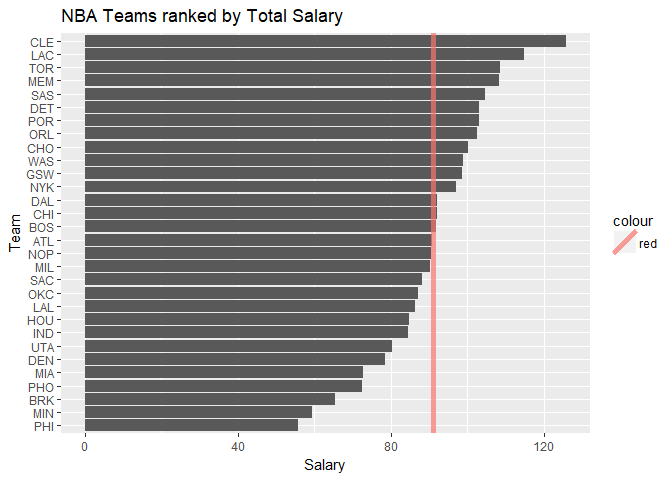
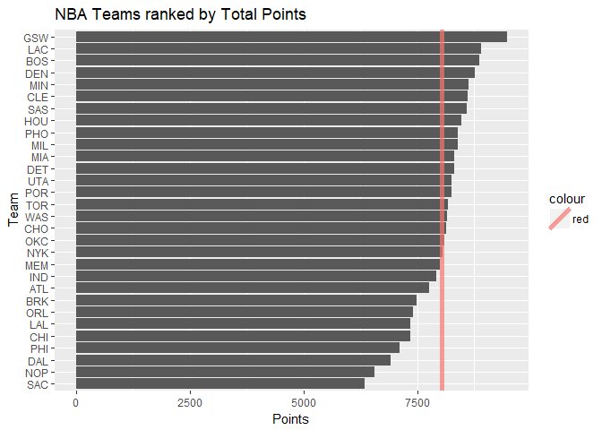
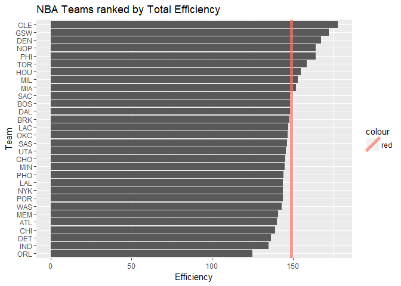
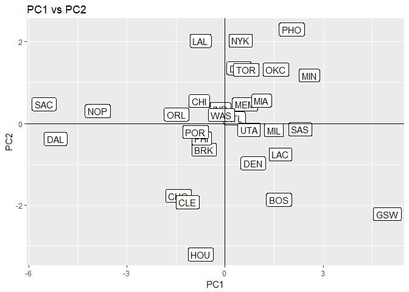
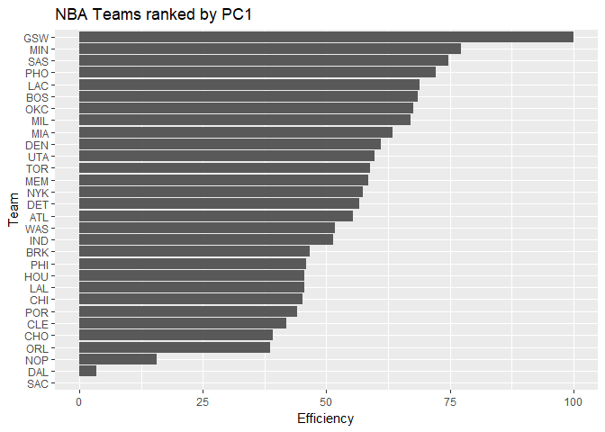

hw03-Jesse-Gao
================
Jesse Gao
October 14, 2017

Ranking of Teams
----------------

``` r
teams = read.csv(file = '../data/nba2017-teams.csv', stringsAsFactors = FALSE)

library(dplyr)
```

    ## Warning: package 'dplyr' was built under R version 3.4.2

    ## 
    ## Attaching package: 'dplyr'

    ## The following objects are masked from 'package:stats':
    ## 
    ##     filter, lag

    ## The following objects are masked from 'package:base':
    ## 
    ##     intersect, setdiff, setequal, union

``` r
library(ggplot2)

ggplot(teams, aes(x=reorder(team, salary), y=salary)) +
  geom_bar(stat='identity') +
  coord_flip() +
  ggtitle("NBA Teams ranked by Total Salary") +
  labs(x = "Team", y = "Salary") +
  geom_abline(aes(intercept = mean(salary), slope = 0, col = "red"), size = 2, alpha = 0.7)
```



About half of the teams are above average in terms of salary, with CLE being the max, and PHI being the min for total salary.

``` r
ggplot(teams, aes(x=reorder(team, points), y=points)) +
  geom_bar(stat='identity') +
  coord_flip() +
  ggtitle("NBA Teams ranked by Total Points") +
  labs(x = "Team", y = "Points") +
  geom_abline(aes(intercept = mean(points), slope = 0, col = "red"), size = 2, alpha = 0.7)
```



It appears that more teams are above average in terms of points, with GSW being the max and SAC being the min

``` r
ggplot(teams, aes(x=reorder(team, efficiency), y=efficiency)) +
  geom_bar(stat='identity') +
  coord_flip() +
  ggtitle("NBA Teams ranked by Total Efficiency") +
  labs(x = "Team", y = "Efficiency") +
  geom_abline(aes(intercept = mean(efficiency), slope = 0, col = "red"), size = 2, alpha = 0.7)
```



It appears that less teams are above average in terms of points, with CLE being the max and ORL being the min

Principal Components Analysis (PCA)
-----------------------------------

``` r
vars = teams[,c("points3", "points2", "free_throws", "off_rebounds", "def_rebounds", "assists", "steals", "blocks", "turnovers", "fouls")]
pca = prcomp(vars, scale. = TRUE)
eigs = data.frame(
  eigenvalue = round(pca$sdev^2,4),
  prop = round(pca$sdev^2 /sum(pca$sdev^2), 4)
  )
eigs$cumprop = round(cumsum(eigs$prop),4)
eigs
```

    ##    eigenvalue   prop cumprop
    ## 1      4.6959 0.4696  0.4696
    ## 2      1.7020 0.1702  0.6398
    ## 3      0.9795 0.0980  0.7378
    ## 4      0.7717 0.0772  0.8150
    ## 5      0.5341 0.0534  0.8684
    ## 6      0.4780 0.0478  0.9162
    ## 7      0.3822 0.0382  0.9544
    ## 8      0.2603 0.0260  0.9804
    ## 9      0.1336 0.0134  0.9938
    ## 10     0.0627 0.0063  1.0001

``` r
rot = data.frame(
  team = teams$team,
  PC1 = pca$x[,"PC1"],
  PC2 = pca$x[,"PC2"]
)
ggplot(data = rot, aes(x = PC1, y = PC2)) +
  geom_label(aes(label = team)) +
  ggtitle("PC1 vs PC2") + 
  geom_hline(yintercept = 0) +
  geom_vline(xintercept = 0)
```



``` r
pca$rotation[,1:2]
```

    ##                    PC1         PC2
    ## points3      0.1121782 -0.65652993
    ## points2      0.3601766  0.32892544
    ## free_throws  0.3227564 -0.17651228
    ## off_rebounds 0.3029366  0.35931603
    ## def_rebounds 0.3719432 -0.12808273
    ## assists      0.3125312 -0.44134618
    ## steals       0.3447256 -0.03540585
    ## blocks       0.3162237  0.06131890
    ## turnovers    0.3353958 -0.02169833
    ## fouls        0.3072548  0.28954426

It appears that PC1 is much more positively correlated with the player stats than PC2. The loading for PC2 is mostly negative, while PC1's loading is completely positive. I think PC1 is more relevant to the data.

Index based on PC1
------------------

``` r
z1 = pca$x[,"PC1"]
s = 100 * (z1 - min(z1))/(max(z1)-min(z1))
teams$s = s
ggplot(teams, aes(x=reorder(team, s), y=s)) +
  geom_bar(stat='identity') +
  coord_flip() +
  ggtitle("NBA Teams ranked by PC1") +
  labs(x = "Team", y = "Efficiency") 
```



It appears that GSW is the highest ranked by PC1 by a large margin. DAL is the lowest, by a large margin as well. The rankings slowly lowers as one moves down the teams, until it hits NOP.

Comments and Reflections
------------------------

This hw was surprisingly hard because of the funky prcomp structure. A large portion of time was spent understanding PCA because I didn't understand it at all in class. Would highly recommend the last two links I put in my README. This hw took around 6 hours, with the last half taking up most of that time. The rest of the hw was easy but tedious. The file structure isn't new to me, I've been programming for some time and I understand the importance of an organized structure. I think it is good practice to work with these structures.
