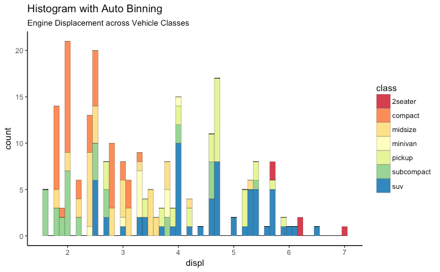
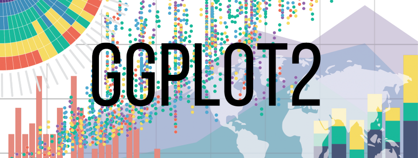
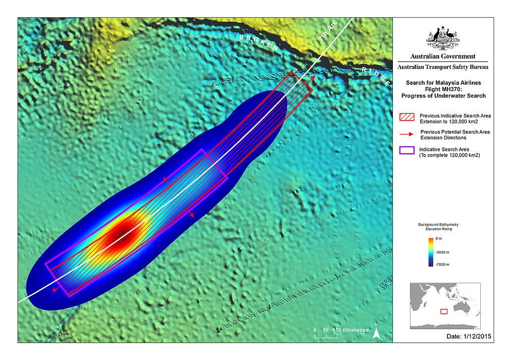
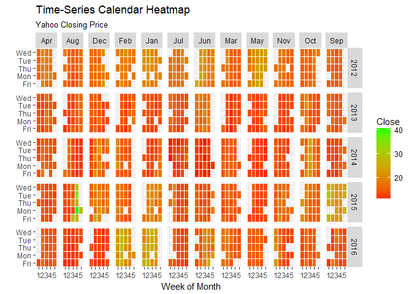
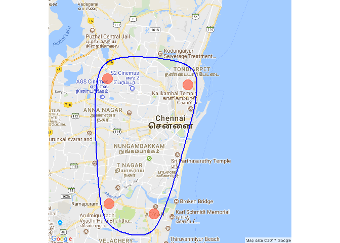

Post02
================
Jesse Gao

Advanced ggplot
===============

Motivation
----------

I would like to begin by stating exactly why I'm writing a post on ggplot. Recently I built a shiny app with ggvis rendering the plots. ggvis was a **horror** to work with. Adding anything to a plot with ggvis requires that you stuff the original ggvis plot into a new layer like a digital turdunken. Two hours of documentation and debugging in order to make it work. Two hours of my life that I will never get back. In comparison, ggplot has a readily intuitive usage, in which you simple add (literally this symbol: +) elements to the ggplot in order to make a beautiful visualization. Papa bless.

Introduction
------------

The ggplot2 package allows for the generation of a variety of data visualization graphs but is accompanied by many automated functions such as automatic legend and graph colors, which is what distinguishes ggplot from the base R graph functions. The possibilities with ggplot are endless but the most popular usages can be found [here](http://r-statistics.co/Top50-Ggplot2-Visualizations-MasterList-R-Code.html) along with example code. One of the examples is shown below. 

Background
----------



ggplot2 was created by Hadley Wickham in 2005 for the R language as an implementaion of Leland Wilkinson's *Grammar of Graphics*, which is a [scheme for breaking up data visualization into components that can be easily put together](https://en.wikipedia.org/wiki/Ggplot2). It has grown to become easily one of the most popular packages in R, so much so that R Studio has incorporated the ggplot2 cheatsheet into its list of helpful cheatsheets. gglot2 allows users to modify components of graph at a high level of abstraction, making unplanned changes much easier. Each layer can simply be appended with a '+'.

Agenda
------

In this post, we will look at spacial visualization and heat maps.

If you are looking to follow along, this is a must have [cheatsheet](https://www.google.com/url?sa=t&rct=j&q=&esrc=s&source=web&cd=5&cad=rja&uact=8&ved=0ahUKEwjGoNmSqO_XAhUBXWMKHdeDDkYQFghIMAQ&url=https%3A%2F%2Fwww.rstudio.com%2Fwp-content%2Fuploads%2F2015%2F03%2Fggplot2-cheatsheet.pdf&usg=AOvVaw2h7GIEDWea6RAIEciUJutQ) It pretty much contains a fairly complete guide of the basics of ggplot2.

Heat Maps
---------

[Heat maps](https://en.wikipedia.org/wiki/Heat_map) represent data in colored matrixes, allowing for attractive and intuitive displays of data. Heat maps are used liberally in [business and political settings](http://searchbusinessanalytics.techtarget.com/definition/heat-map), because it gives an immediate visual summary of information, which helps to express large quantities of numerical data that can be categorized. A sample picture of a heat map is shown below. 

We will be walking through an advance example here. First be sure to have the following packages installed.

``` r
library(ggplot2)
library(plyr)
library(scales)
library(zoo)
```

    ## Warning: package 'zoo' was built under R version 3.4.3

    ## 
    ## Attaching package: 'zoo'

    ## The following objects are masked from 'package:base':
    ## 
    ##     as.Date, as.Date.numeric

The data we will be using is provided below. It contains information on the closing price of Yahoo. We first format and filter the data we need.

``` r
df <- read.csv("https://raw.githubusercontent.com/selva86/datasets/master/yahoo.csv")
df$date <- as.Date(df$date)  # format date
df <- df[df$year >= 2012, ]  # filter reqd years
# Create Month Week
df$yearmonth <- as.yearmon(df$date)
df$yearmonthf <- factor(df$yearmonth)
df <- ddply(df,.(yearmonthf), transform, monthweek=1+week-min(week))  # compute week number of month
df <- df[, c("year", "yearmonthf", "monthf", "week", "monthweek", "weekdayf", "VIX.Close")]
head(df)
```

    ##   year yearmonthf monthf week monthweek weekdayf VIX.Close
    ## 1 2012   Jan 2012    Jan    1         1      Tue     22.97
    ## 2 2012   Jan 2012    Jan    1         1      Wed     22.22
    ## 3 2012   Jan 2012    Jan    1         1      Thu     21.48
    ## 4 2012   Jan 2012    Jan    1         1      Fri     20.63
    ## 5 2012   Jan 2012    Jan    2         2      Mon     21.07
    ## 6 2012   Jan 2012    Jan    2         2      Tue     20.69

Next we use ggplot to create the heatmap one component at a time. The walkthrough is in the comments.

``` r
# Put the dataframe and the proper columns into the ggplot's "base"
ggplot(df, aes(monthweek, weekdayf, fill = VIX.Close)) + 
  # Split the heatmap for each weekday into tiles colored white by default
  geom_tile(colour = "white") + 
  # create a visual for each month
  facet_grid(year~monthf) + 
  # color each time according to the Closing Price
  scale_fill_gradient(low="red", high="green") +
  # Label the graph
  labs(x="Week of Month",
       y="",
       title = "Time-Series Calendar Heatmap", 
       subtitle="Yahoo Closing Price", 
       fill="Close")
```



There you go, you now have a heatmap for the closing price of Yahoo for each weekday split by month.

Spatial Visualization
---------------------

In this part we will introduce another package: [ggmap](http://www.milanor.net/blog/maps-in-r-choropleth-maps/). It accompanies ggplot very well because it allows for ggplot to render data alongside maps.

First we load up the packages:

``` r
# load packages
library(ggplot2)
library(ggmap)
```

    ## Warning: package 'ggmap' was built under R version 3.4.2

``` r
library(ggalt)
```

    ## Warning: package 'ggalt' was built under R version 3.4.3

We can use ggmap for the, uh, map and ggplot to draw certain features, like an encircling line.

``` r
# Get Chennai's Coordinates
chennai <-  geocode("Chennai")  # get longitude and latitude
```

    ## Information from URL : http://maps.googleapis.com/maps/api/geocode/json?address=Chennai&sensor=false

``` r
# Google Road Map
chennai_ggl_road_map <- qmap("chennai", zoom=12, source = "google", maptype="roadmap")  
```

    ## Map from URL : http://maps.googleapis.com/maps/api/staticmap?center=chennai&zoom=12&size=640x640&scale=2&maptype=roadmap&language=en-EN&sensor=false

    ## Information from URL : http://maps.googleapis.com/maps/api/geocode/json?address=chennai&sensor=false

    ## Warning: `panel.margin` is deprecated. Please use `panel.spacing` property
    ## instead

``` r
# Get Coordinates for Chennai's Places 
chennai_places <- c("Kolathur",
                    "Washermanpet",
                    "Adyar",
                    "Guindy")
# get longitudes and latitudes
places_loc <- geocode(chennai_places)  
```

    ## Information from URL : http://maps.googleapis.com/maps/api/geocode/json?address=Kolathur&sensor=false

    ## Information from URL : http://maps.googleapis.com/maps/api/geocode/json?address=Washermanpet&sensor=false

    ## Information from URL : http://maps.googleapis.com/maps/api/geocode/json?address=Adyar&sensor=false

    ## Information from URL : http://maps.googleapis.com/maps/api/geocode/json?address=Guindy&sensor=false

``` r
# Plot some points and draw the circle
chennai_ggl_road_map  + geom_point(aes(x=lon, y=lat),
                             data = places_loc, 
                             alpha = 0.7, 
                             size = 7, 
                             color = "tomato") + 
                  geom_encircle(aes(x=lon, y=lat),
                                data = places_loc, size = 2, color = "blue")
```



Conclusion
----------

As you can see, even the more advanced examples of ggplot are not hard to digest because of ggplot's modularity. Exploring ggplot2 really exposes you to a variety of useful data visualization tools that makes it easy to express your data. Heat maps and spacial visualization often overlap and are vital for getting a point across in today's fast moving world. Being able to use these tools can effectively make you a better data scientist.

References
----------

-   <http://r-statistics.co/Top50-Ggplot2-Visualizations-MasterList-R-Code.html>
-   <https://en.wikipedia.org/wiki/Ggplot2>
-   <https://www.google.com/url?sa=t&rct=j&q>=&esrc=s&source=web&cd=5&cad=rja&uact=8&ved=0ahUKEwjGoNmSqO\_XAhUBXWMKHdeDDkYQFghIMAQ&url=https%3A%2F%2Fwww.rstudio.com%2Fwp-content%2Fuploads%2F2015%2F03%2Fggplot2-cheatsheet.pdf&usg=AOvVaw2h7GIEDWea6RAIEciUJutQ
-   <https://en.wikipedia.org/wiki/Heat_map>
-   <https://en.wikipedia.org/wiki/Heat_map#/media/File:MH370_location_probability_heat_map_per_DST_Group_analysis.jpg>
-   <http://searchbusinessanalytics.techtarget.com/definition/heat-map>
-   <http://www.milanor.net/blog/maps-in-r-choropleth-maps/>
