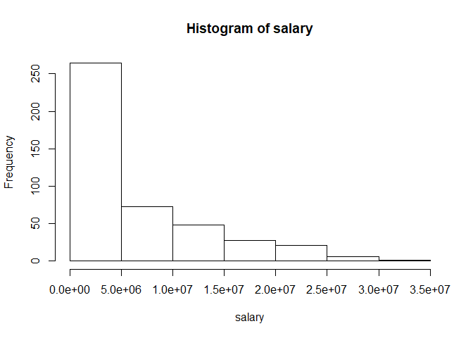
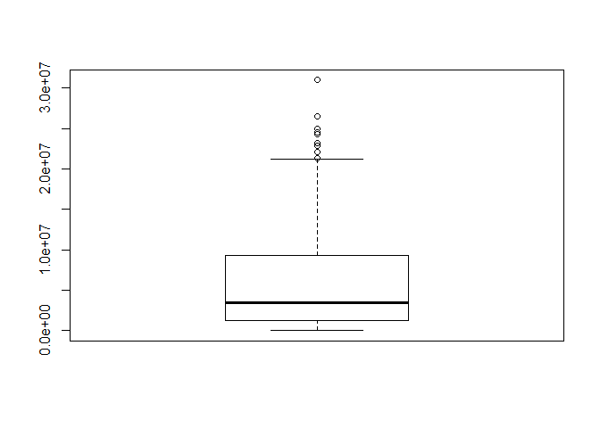
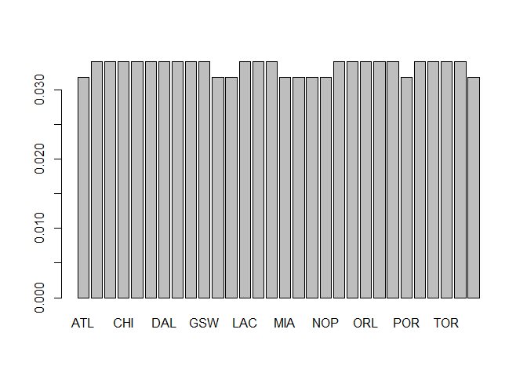

up02-jesse-gao.Rmd
================
Jesse Gao
September 15, 2017

Exploratory Data Analysis
=========================

``` r
# load the objects
load("./data/nba2017-salary-points.RData")

# list the available objects
ls()
```

    ## [1] "experience" "player"     "points"     "points1"    "points2"   
    ## [6] "points3"    "position"   "salary"     "team"

Quantitative Variable
---------------------

``` r
summary(salary)
```

    ##     Min.  1st Qu.   Median     Mean  3rd Qu.     Max. 
    ##     5145  1286160  3500000  6187014  9250000 30963450

``` r
sort(table(salary), decreasing = TRUE)[1:3]
```

    ## salary
    ##  543471  874636 1015696 
    ##      21       9       8

``` r
max(salary) - min(salary)
```

    ## [1] 30958305

``` r
hist(salary)
```



``` r
boxplot(salary)
```



The typical values for salary are 543471, 874636, and 1015696

The spread is 20958305

Most of the players get paid less than 10 million

Qualitative variable
--------------------

``` r
summary(team)
```

    ## ATL BOS BRK CHI CHO CLE DAL DEN DET GSW HOU IND LAC LAL MEM MIA MIL MIN 
    ##  14  15  15  15  15  15  15  15  15  15  14  14  15  15  15  14  14  14 
    ## NOP NYK OKC ORL PHI PHO POR SAC SAS TOR UTA WAS 
    ##  14  15  15  15  15  15  14  15  15  15  15  14

``` r
teamfactor = factor(team)
table(team)
```

    ## team
    ## ATL BOS BRK CHI CHO CLE DAL DEN DET GSW HOU IND LAC LAL MEM MIA MIL MIN 
    ##  14  15  15  15  15  15  15  15  15  15  14  14  15  15  15  14  14  14 
    ## NOP NYK OKC ORL PHI PHO POR SAC SAS TOR UTA WAS 
    ##  14  15  15  15  15  15  14  15  15  15  15  14

``` r
freq = prop.table(table(team))
barplot(freq)
```



It looks like most of the teams have the same number of people.
